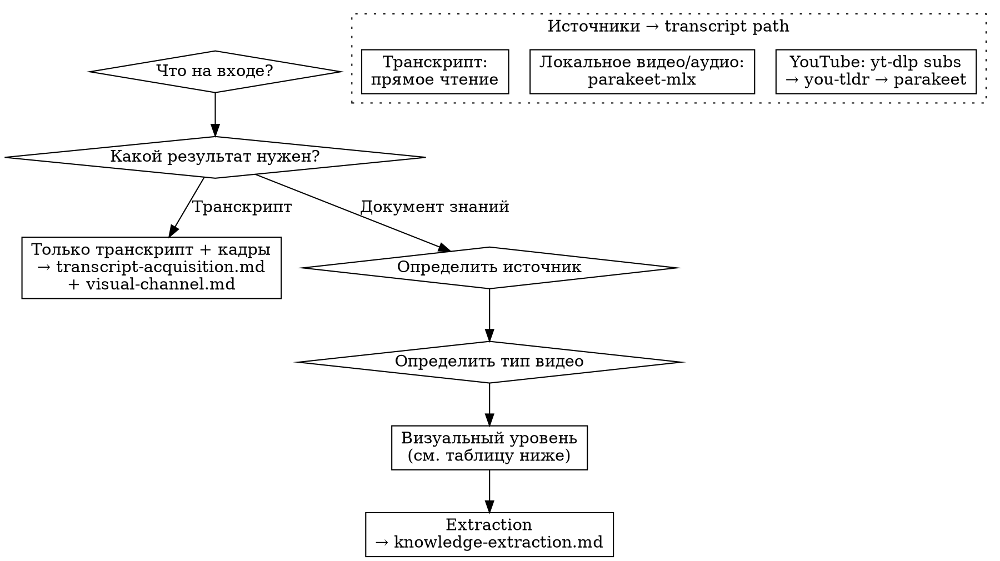

# Video Knowledge Extraction

Извлечение структурированных знаний из видео. Документ знаний плотнее исходного видео (~1:6 компрессия). Для транскриптов без extraction → см. «Только транскрипт» в decision tree.

---

## When to Use

- Пользователь дал YouTube URL / локальное видео / аудио / транскрипт и просит извлечь знания, идеи, инсайты
- Пользователь хочет документ знаний из видеоконтента
- Пользователь просит «сделай транскрипт с кадрами» без полной экстракции

## When NOT to Use

- Пользователь просит просто посмотреть видео → это не extraction
- Аудио без запроса на знания → это транскрипция, не extraction

---

## Decision Tree

### Quick Reference: Визуальный уровень

| Тип видео | Уровень | Что делать | Подробнее |
|-----------|---------|-----------|-----------|
| Tutorial/Demo, Review, Short | **Полный** | ffmpeg → filter → MCP классификация → inline | visual-channel.md |
| Lecture/Educational | **Лёгкий** | ffmpeg → filter → кадры в keyframes/ | visual-channel.md |
| Interview/Podcast, Vlog | **Пропустить** | Ничего | visual-channel.md |

### Quick Reference: Транскрипт

| Вход | Путь | Подробнее |
|------|------|-----------|
| YouTube URL | yt-dlp subs → you-tldr → parakeet-mlx | transcript-acquisition.md |
| Локальное видео/аудио | parakeet-mlx | transcript-acquisition.md |
| Транскрипт (.srt/.vtt/.txt) | Прямое чтение | — |

---

## Core Principles

**1. Компрессия ~1:6.** Видео менее плотные, чем книги. 30-мин видео → 3-5 мин чтения. Не 1:10 как с книгами.

**2. Chronological order test.** Если временные метки в «Главных идеях» идут по возрастанию — вы следовали за видео, а не за темами. Перегруппировать.

**3. Visual knowledge ≠ visual confirmation.** Визуальное знание = того, чего НЕТ в аудио. Слайд, который спикер читает вслух — это подтверждение, не знание. Тест «закрой транскрипт»: если можно восстановить содержание кадра по памяти — это не визуальное знание.

**4. Density → compression level.** Высокая плотность → умеренная компрессия. Низкая → агрессивная. Цель: документ всегда плотнее источника.

**5. Два режима работы.** Full extraction (все фазы → документ знаний) vs transcript prep (только Фаза 0 → транскрипт + кадры). Режим определяет пользователь, не Claude.

---

## Common Mistakes

- **Хронологический порядок идей** — вы извлекли в порядке видео, а не по темам. Метки по возрастанию = красный флаг
- **Визуальные подтверждения как знания** — слайд, который спикер озвучил, не является визуальным знанием
- **Банальные инсайты** — «AI изменит всё» не проходит banality test
- **Полный визуал для интервью** — talking head, визуальных знаний нет, уровень = Пропустить
- **Недостаточная компрессия** — документ читается как «сначала он сказал X, потом Y». Должен содержать знания, не хронику
- **Дублирование между секциями** — одна мысль в «Проблемах» и «Инсайтах» = дедупликация не пройдена

---

## Files

- `references/transcript-acquisition.md` — получение транскрипта из любого источника, bash-команды, rolling captions
- `references/visual-channel.md` — три уровня визуала, ffmpeg, filter-talking-heads, MCP классификация, inline-изображения
- `references/knowledge-extraction.md` — фазы 1-3 (картирование, извлечение, структурирование), quality gates, компрессия
- `references/templates.md` — шаблон документа знаний
- `references/quality-checklists.md` — полные чеклисты
- `scripts/srt-clean.py` — очистка rolling captions (YouTube auto-subs)
- `scripts/filter-talking-heads.py` — удаление talking heads из keyframes

**REQUIRED SUB-SKILL:** book-knowledge-extraction (cognitive quality principles: контекст, типология пользы, синтаксис действия, armament test)
